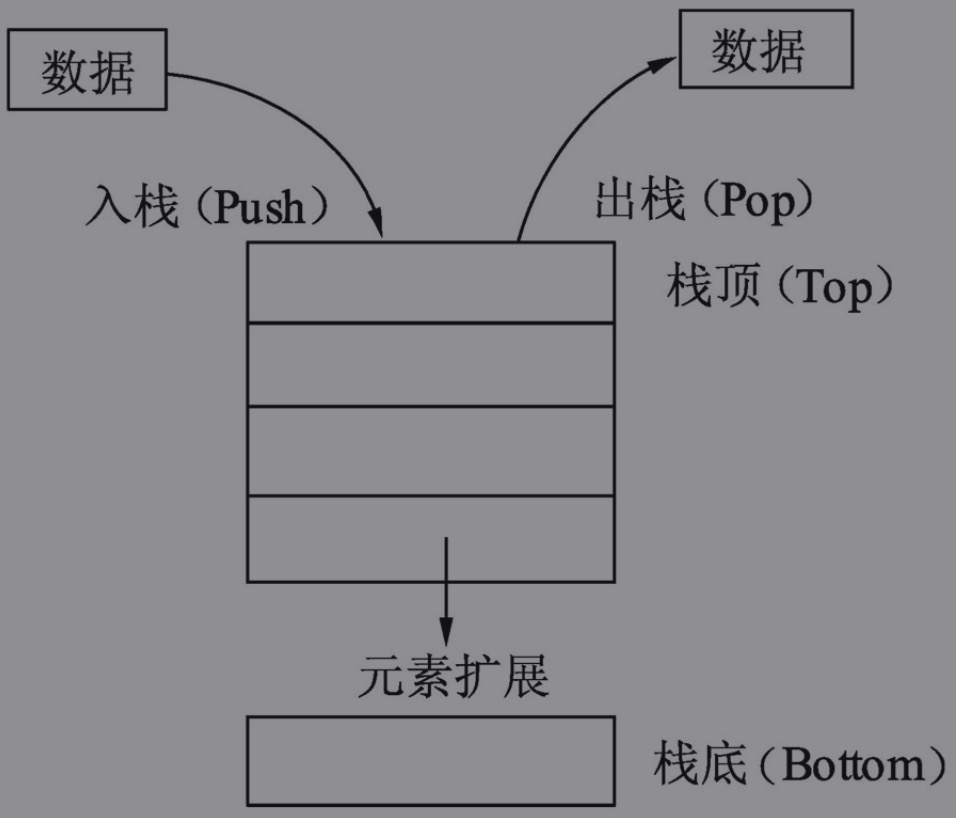
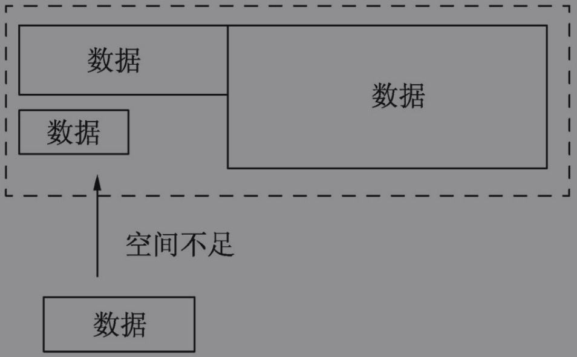

# 概念类

Go语言在多核并发上拥有原生的设计优势。

使用更少的硬件资源而有更高的并发和I/O吞吐表现。

Go语言简单易学，学习曲线平缓，不需要像C/C++语言动辄需要两到三年的学习期。

Go语言被称为“互联网时代的C语言”。

互联网的短、频、快特性在Go语言中体现得淋漓尽致。

Go语言是Google公司开发的一种静态型、编译型并自带垃圾回收和并发的编程语言。

Go语言最有特色的特性莫过于goroutine。Go语言在语言层可以通过goroutine对函数实现并发执行。goroutine类似于线程但是并非线程，goroutine会在Go语言运行时进行自动调度。因此，Go语言非常适合用于高并发网络服务的编写。

_\*操作符作为右值时，意义是取指针的值；作为左值时，也就是放在赋值操作符的左边时，表示a指向的变量。其实归纳起来，\*_ 操作符的根本意义就是操作指针指向的变量。当操作在右值时，就是取指向变量的值；当操作在左值时，就是将值设置给指向的变量。

### 堆栈

**栈**

栈（Stack）是一种拥有特殊规则的线性表数据结构。栈只允许往线性表的一端放入数据，之后在这一端取出数据，按照后进先出（LIFO, Last In First Out）的顺序。

往栈中放入元素的过程叫做入栈。入栈会增加栈的元素数量，最后放入的元素总是位于栈的顶部，最先放入的元素总是位于栈的底部。

从栈中取出元素时，只能从栈顶部取出。取出元素后，栈的数量会变少。最先放入的元素总是最后被取出，最后放入的元素总是最先被取出。不允许从栈底获取数据，也不允许对栈成员（除栈顶外的成员）进行任何查看和修改操作。

**变量和栈有什么关系**

栈可用于内存分配，栈的分配和回收速度非常快。

#### 堆

堆分配内存和栈分配内存相比，堆适合不可预知大小的内存分配。但是为此付出的代价是分配速度较慢，而且会形成内存碎片。

**Go**编译器觉得变量应该分配在堆和栈上的原则是:

1. 变量是否发生逃逸。
2. 变量是否被取地址。

