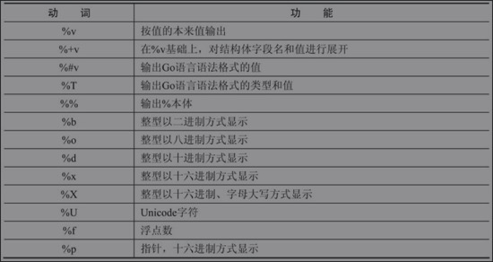

# 格式化参考

| 写法 | 作用 |
| :--- | :--- |
| %p | 变量取地址后的指针值 |
| %T | 获取数据类型 |
| %v | 相应值的默认格式。在打印结构体时，“加号”标记（%+v）会添加字段名 |
| %\#v | 相应值的 Go 语法表示 |
| %t | 布尔值 |
| %b | 二进制 |
| %c | 相应 Unicode 码点所表示的字符 |
| %d | 十进制 |
| %o | 八进制 |
| %x | 十六进制小写格式 |
| %X | 十六进制大写格式 |
| %f | 有小数点而无指数 |
| %s | 字符串或切片的无解译字节 |

