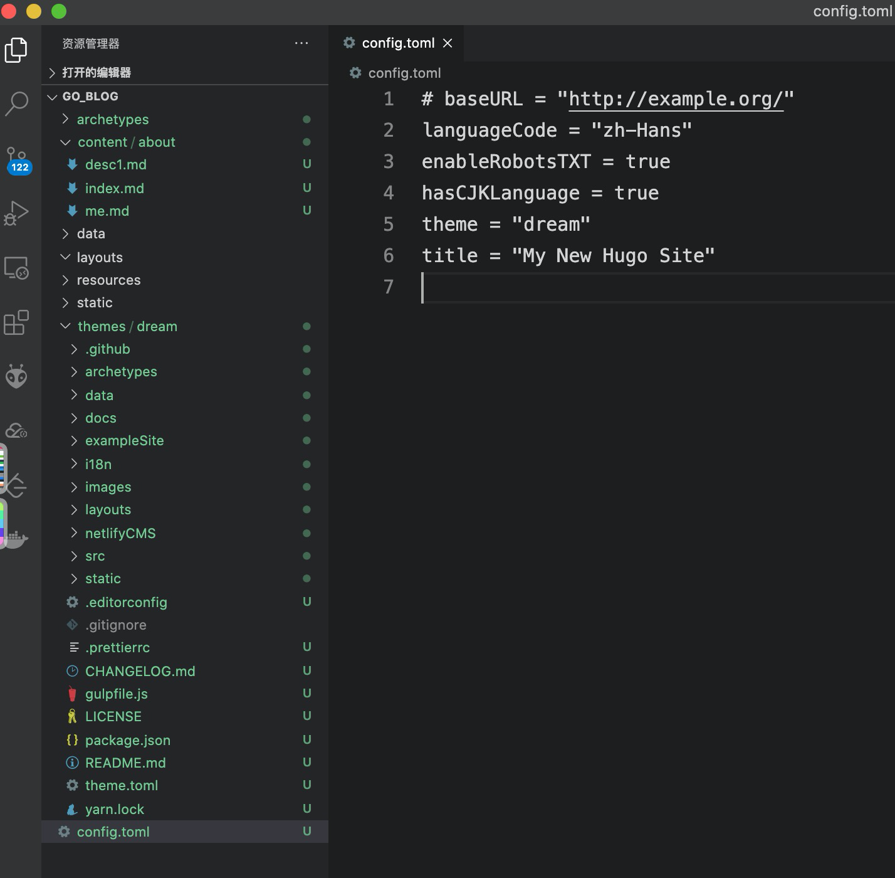

# Hugo

感觉有点像vue-press，之前用vue-press开发过一个api接口文档的项目，实现了接口的测试，现在研究Hugo是准备给女朋友弄一个项目部署到serverless上，毕竟博客园太丑了，辣眼的很。



#### 安装

```text
brew install hugo
```

brew升级检测太慢，禁用检测Homebrew

```text
#.bash_profile配置如下

export HOMEBREW_NO_AUTO_UPDATE=true
```

#### 检查是否安装成功

```text
hugo version
```

#### 新建项目

```text
hugo new site go_blog
```

#### 初始化项目

```text
cd go_blog/

git init
```

#### 主题安装

这个就不造轮子了，先拿个看起来不错的主题来用，样式不合适的地方完了再重写样式。

主题



主题文档

[https://g1eny0ung.site/hugo-theme-dream/\#/](https://g1eny0ung.site/hugo-theme-dream/#/)

```text
cd themes
git clone https://github.com/g1eny0ung/hugo-theme-dream.git dream
```

从Github上拉代码简直太慢，搭梯子都不好使，这里使用Gitee码云新建仓库，把GitHub代码拉到码云仓库，然后在码云仓库拉代码，速度快的一匹。

```text
git clone https://gitee.com/yunsinek_admin/hugo-theme-dream-github.git dream
```

#### 配置主题



#### 新建about

```text
hugo new about/me.md
```

#### 在about目录下新建index

```text
# index.md

---
headless: true
---
```

#### 创建一篇文章

```text
hugo new posts/articleTitle.md
```

