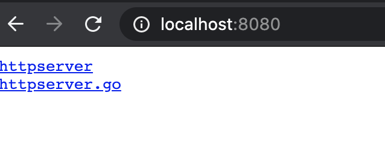

# HTTP server

新建文件 httpserver.go


这里注意同一个包下不能有不同的package名称，建议开始学习的时候一个go文件存放在一个单独的文件夹中


```go
//标记当前文件为main包，main包也是Go程序的入口包
package main

//导入net/http包，这个包的作用是HTTP的基础封装和访问
import (
	"net/http"
)

//程序执行的入口函数main()
func main() {
	
	//使用http.File Server文件服务器将当前目录作为根目录（“/”）的处理器，访问根目录，就会进入当前目录
	http.Handle("/", http.FileServer(http.Dir(".")))
	
	//默认的HTTP服务侦听在本机8080端口
	http.ListenAndServe(":8080", nil)
}
```

```text
$ go run httpserver.go
```

本地访问 



