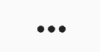
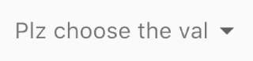
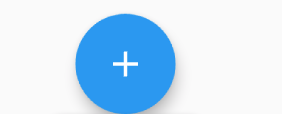

# Button

#### 普通按钮


```dart
MaterialButton(
  shape: RoundedRectangleBorder(
    borderRadius: BorderRadius.circular(20),
  ),
  color: Colors.pink,
  child: Text('Hello Btn'),
  onPressed: () => {},
),
```

#### 可设置没有背景、没有边框的按钮，点击有水波纹效果


```dart
RawMaterialButton(
  onPressed: () => {},
  shape: RoundedRectangleBorder(
    borderRadius: BorderRadius.circular(10),
  ),
  fillColor: Colors.pink,
  child: Text('Hello Btn'),
),
```

#### 扁平按钮


```dart
FlatButton(
    onPressed: () => {},
    child: Text("Hello Btn"),
    color: Colors.deepPurple,
),
```

#### 边框按钮


```dart
OutlineButton(
    onPressed: () => {},
    borderSide: BorderSide(color: Colors.deepPurple),
    child: Text("Hello Btn"),
),
```

#### 凸起按钮


```dart
RaisedButton(
    onPressed: () => {},
    color: Colors.deepPurple,
    child: Text("Hello Btn"),
),
```

#### 图标按钮


```dart
IconButton(
    icon: Icon(Icons.ac_unit),
    onPressed: () => {},
    color: Colors.lightBlue,
),
```

#### 切换按钮


```dart
ToggleButtons(
  children: [
    Icon(Icons.ac_unit),
    Icon(Icons.access_alarm),
    Icon(Icons.access_time),
  ],
  isSelected: [true, false, true],
  onPressed: (t) {
    //to_do
  },
),
```

#### More按钮--



```dart
PopupMenuButton(
  itemBuilder: (_) => [
    PopupMenuItem(child: Text('A')),
    PopupMenuItem(child: Text('B')),
    PopupMenuItem(child: Text('C')),
    PopupMenuItem(child: Text('D')),
  ],
),
```

#### 类似Select的按钮


```dart
DropdownButton(
  hint: Text('Plz choose the val'),
  items: [
    DropdownMenuItem(
      child: Text("A"),
      value: 1,
    ),
    DropdownMenuItem(
      child: Text("B"),
      value: 2,
    ),
    DropdownMenuItem(
      child: Text("C"),
      value: 3,
    ),
    DropdownMenuItem(
      child: Text("D"),
      value: 4,
    ),
  ],
  onChanged: (item) {
    print(item);
  },
  value: null,
),
```

#### 类似Select，但是没有下划线的按钮



```dart
DropdownButtonHideUnderline(
  child: DropdownButton(
    hint: Text('Plz choose the val'),
    items: [
      DropdownMenuItem(
        child: Text("A"),
        value: 1,
      ),
      DropdownMenuItem(
        child: Text("B"),
        value: 2,
      ),
      DropdownMenuItem(
        child: Text("C"),
        value: 3,
      ),
      DropdownMenuItem(
        child: Text("D"),
        value: 4,
      ),
    ],
    onChanged: (item) {
      print(item);
    },
    value: null,
  ),
),
```

#### 圆形按钮



```dart
FloatingActionButton(
    key: UniqueKey(),
    heroTag: UniqueKey(),
    onPressed: () => {},
    child: Icon(Icons.add),
),
```

